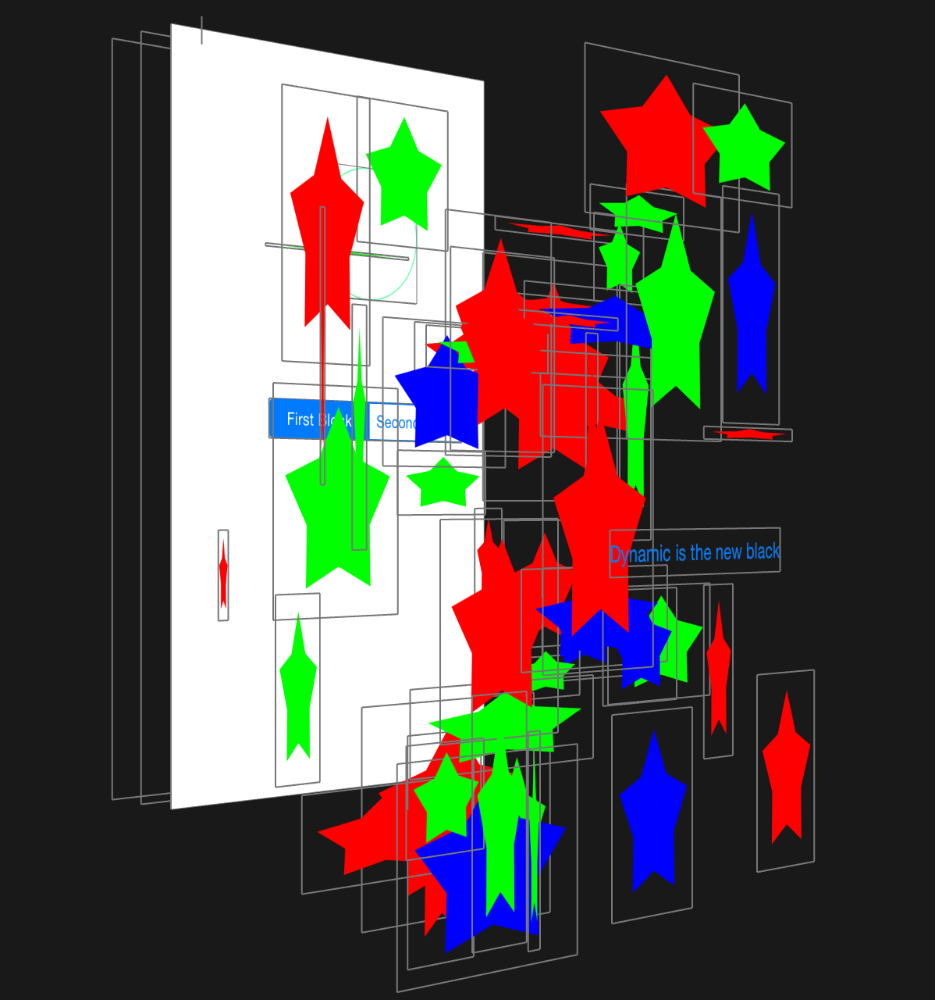

# BMDrawRectView

[](http://cocoadocs.org/docsets/BMDrawRectView)
[](http://cocoadocs.org/docsets/BMDrawRectView)
[](http://cocoadocs.org/docsets/BMDrawRectView)

## Concept

The idea behind this dead-simple class was to get rid of the need to create a UIView subclass every time I wanted to do something simple, quick, or in a block-based dynamic fashion. With this little tool, you can skip that step and be as dynamic or static, but most importantly, *custom* as you like - without leaving the class you're working on.

```
// You may want to switch the drawrect block of the view at runtime...
- (void)updateBlockChoiceFromSegmentedController
{
    BMDrawRectBlock firstBlock = ^(CGRect rect)
    {
        CGContextRef ctx = UIGraphicsGetCurrentContext();
        CGContextSetStrokeColorWithColor(ctx, [UIColor colorWithRed:0.401 green:1.000 blue:0.695 alpha:1.000].CGColor);
        CGContextStrokeEllipseInRect(ctx, rect);
    };

    BMDrawRectBlock secondBlock = ^(CGRect rect)
    {
        CGContextRef ctx = UIGraphicsGetCurrentContext();
        CGContextSetFillColorWithColor(ctx, [UIColor colorWithRed:0.401 green:0.5 blue:0.695 alpha:1.000].CGColor);
        CGContextFillEllipseInRect(ctx, rect);
    };

    _storyboardCreatedView.drawRectBlock = (_segmentedControl.selectedSegmentIndex ? secondBlock : firstBlock);
}
```

```
// Or just create it NOW to muck about with an idea:
- (void)viewDidLoad
{
    [super viewDidLoad];
    [self.view addSubview:[BMDrawRectView viewWithDrawRectBlock:^(CGRect rect)
    {
        // Your CGContext/drawRect magic here!
    }];
}
```

## Usage

To run the example project, clone the repo, and run `pod install` from the Example directory first. The example project
looks all pretty if you have a play with it - [Reveal](revealapp.com) shows it like this:



## Requirements

The desire to better thyself. Aside from that, nothing.

## Installation

BMDrawRectView is available through [CocoaPods](http://cocoapods.org). To install
it, add the following line to your Podfile:

    pod "BMDrawRectView"

## Author

Adam Iredale, [@iosengineer](https://twitter.com/iosengineer)

## License

BMDrawRectView is available under the MIT license. See the LICENSE file for more info.

